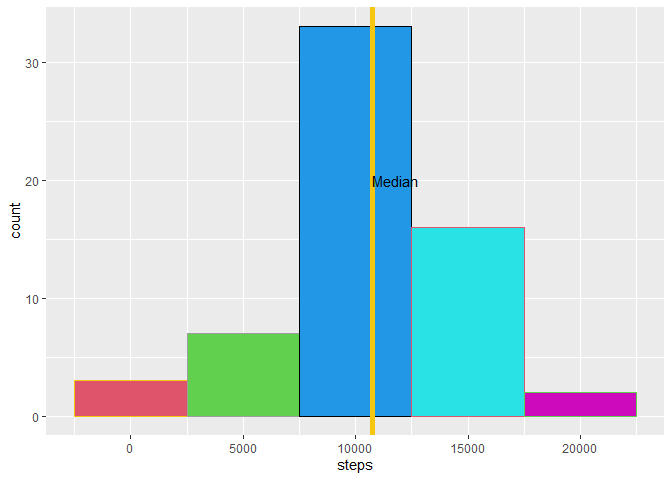

<br>
Loading Packages:

```r
library(tidyverse)
```

```
## -- Attaching packages --------------------------------------- tidyverse 1.3.0 --
```

```
## v ggplot2 3.3.3     v purrr   0.3.4
## v tibble  3.0.6     v dplyr   1.0.4
## v tidyr   1.1.2     v stringr 1.4.0
## v readr   1.4.0     v forcats 0.5.1
```

```
## -- Conflicts ------------------------------------------ tidyverse_conflicts() --
## x dplyr::filter() masks stats::filter()
## x dplyr::lag()    masks stats::lag()
```
<br>

# Step 1  
Downloading and Reading in the dataset. 
<br>

```r
url <- "https://d396qusza40orc.cloudfront.net/repdata%2Fdata%2Factivity.zip"
download.file(url, "data.zip")
data_complete<- (read.csv(unz("data.zip", "activity.csv")))
data_complete$date<- as.Date(data_complete$date)
data<- na.omit(data_complete)
```
<br>

# Step 2  
Day-wise total steps and histogram

```r
data2<- data %>% group_by(date) %>% summarise(steps=sum(steps))
```

```r
ggplot(data2, aes(steps)) + geom_histogram(binwidth = 5000, color=7:11, fill= 2:6)+ geom_vline(aes(xintercept = median(steps)), color=15, size=2) + annotate(geom ="text", x = mean(data2$steps)+1000, y = 20, label = "Median")
```


<br>

# Step 3:  
Calculating the Mean and Median of the Steps Taken Each Day

```r
data_mean <- format(mean(data2$steps), scientific = F)
data_median <- format(median(data2$steps), scientific = F)
```
Hence, the mean of the total steps taken each day = 10766.19 and median of the total steps taken each day = 10765.

# Step 4: 
Average Steps of each five-minute interval over the days and timeseries plot:

```r
interval_means<- data %>% group_by(interval) %>% summarize(avg = mean(steps, na.rm = T))
```

```r
ggplot(interval_means, aes(x=interval, y = avg)) +geom_line(linetype=1, color="Blue")
```


```r
most_active <- format(sqldf::sqldf("Select interval from interval_means where avg = (Select max(avg) from interval_means)"), scientific = F)
```
<br>
We see that the on average, the maximum number of steps is in the 5 minute interval starting at 835 minutes.
<br>

# Step 5:  
Dealing with Missing Values ->

```r
 NA_count <- format(nrow(data_complete%>% filter(is.na(steps))),scientific = F)
```
Hence, the number of missing observations for steps = 2304.
<br>
Imputing the Values: 
Imputing NAs by interval-wise means. 

```r
imputed<- data_complete %>% group_by(interval) %>% mutate(steps_new=ifelse(is.na(steps),mean(steps, na.rm = T), steps))
```
<br>
Creating a histogram for day-wise steps : Using Imputed data.frame

```r
data2<- imputed %>% group_by(date) %>% summarise(steps=sum(steps_new))
```

```r
ggplot(data2, aes(steps)) + geom_histogram(binwidth = 5000, color=7:11, fill= 2:6)+ geom_vline(aes(xintercept = median(steps)), color=15, size=2) + annotate(geom ="text", x = mean(data2$steps)+1000, y = 20, label = "Median")
```


<br>

# Step 6  
Are there any differences in activity patterns between Weekdays and Weekends?

```r
DOW<- imputed %>% mutate(day = as.factor(ifelse(weekdays(date)=="Saturday"| weekdays(date)=="Sunday", "Weekend", "Weekday"))) %>% group_by(day,interval)%>% summarize(steps = mean(steps_new))
```

```
## `summarise()` has grouped output by 'day'. You can override using the `.groups` argument.
```

```r
ggplot(DOW, aes(interval, steps))+ facet_grid(day~., switch = "x")+geom_line(type =1, color = "Blue") + labs(y= "Number of Steps", x= "Interval")
```

```
## Warning: Ignoring unknown parameters: type
```


<br>
The range of movements for weekends is lower as compared to that of weekdays.
<br>
